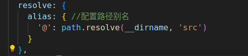

## 使用逻辑

1 首先是安装

>npm install vue-router@4

2 配置路径别名

文件地址：[vite配置文件](./vite.config.js)

需要注意：
- 1 导入相关的path包
- 2 配置如下



3 创建router：[router 文件夹及路由文件](./router/index.js)

4  [在main.js中使用插件](main.js)

5 [在Vue.app中使用](App.vue)

6 注意在views文件夹下创建两个组件

Notes，整个逻辑是这样的：
```
 安装好了，配置完路径别名，在router文件夹下创建router,设置路由模式，匹配路由规则：将对应的components 和 设置的路由地址 关联起来；视图全放在view的文件夹下；然后在main.js 引入 创建的router，挂在到app上，最后在vue.app中使用<router-view />

```


## 相关链接

1[vue-router 官网](https://router.vuejs.org/zh/guide/)
